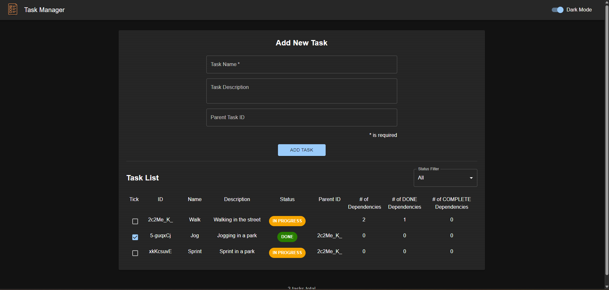

# 🚀 Task Manager (v1.4.0)

A simple and responsive **Task Manager** built with **React**, **TypeScript**, and **Material-UI (MUI)**.

---

## 📌 Features (v1.3.1)

✅ Add **Child tasks** in **Parent Task**

---

## 📜 Version History

### 🔹 v1.3.1

- Tick a **Task** also will update **Parent Task**

### 🔹 v1.3.0

- Add **No of Dependency**, **No of DONE Dependency** and **No of COMPLETE Dependency**

### 🔹 v1.2.1

- Add **Circular Dependency Check** in the **Task List**

### 🔹 v1.2.0

- Add **Parent ID** in the **Task List**
- Minor **UI** Improvement

### 🔹 v1.1.0

- Add **Filter Dropdown** on the right of **Task List**

### 🔹 v1.0.0

- **Add & Toggle Task Status**
- **Light/Dark Mode** 🌙☀️ (Saved in `localStorage`)
- **Responsive Design** (Optimized for Mobile & Desktop)
- **Modular Code Structure**
